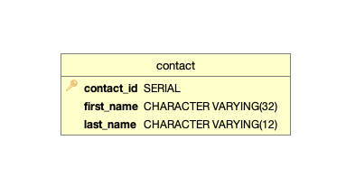

# Gaggle Technical Assessment 

The demo utilizes Eclipse IDE for Enterprise Java and Web Developers. This project uses Maven project build structures with Spring Boot as well as other dependencies shown in the pom.xml for both the server & client side. Development was done using Java SDK version 11.0.8. The entire project utilizes PostgreSQL 13 as a database service & DB Visualizer Free 12.1.1.


## How to set up the database

1. Start PostgreSQL 13.
2. Open Db Visualizer.
   1. File > Open > New SQL Commander.
   2. In the window, create a new database & call it “directoryofnames”.
   		1. CREATE DATABASE directoryofnames2;
   3. Database > Create a Database Connection.
   		1. Select "no wizard".
   			1. Name: directoryofnames
			2. Driver (JDBC):PostgreSQL
			3. Database: directoryofnames
			4. Databse Userid: postgres
			5. Database Password: Novaprime@2014
   4. File > Open > database/schema.sql.
   5. Database > Reconnect > directoryofnames.
   6. SQL Commander > Execute.


## How to start the application

1. Open Eclipse
   1. Import gaggle-server-side.
   2. Import gaggle-client-side.
   3. For gaggle-server-side.
   		• Right click on NoahYohanesGaggleInterviewApplication.java and run as a java application under com.gaggle.server.
   4. For gaggle-client-side.
   		• Right click on App.java & run as a java application under com.gaggle.directory.

Prompts will appear in the Console.

## Sample screens

### Main Menu
```
---------------------------------------------
 
█▀▄▀█ ▄▀█ █ █▄░█   █▀▄▀█ █▀▀ █▄░█ █░█
█░▀░█ █▀█ █ █░▀█   █░▀░█ ██▄ █░▀█ █▄█
          
---------------------------------------------

1 ►ʟᴏᴏᴋ ᴜᴘ ᴄᴏɴᴛᴀᴄᴛ ʙʏ ɴᴀᴍᴇ
2 ►ʟᴏᴏᴋ ᴜᴘ ᴄᴏɴᴛᴀᴄᴛ ʙʏ ɪᴅ
3 ►ᴇxɪᴛ

ᴘʟᴇᴀsᴇ ᴄʜᴏᴏsᴇ ᴀɴ ᴏᴘᴛɪᴏɴ → 
```

### Menu Option #1: Look Up Contact By Name
```
𝙋𝙡𝙚𝙖𝙨𝙚 𝙀𝙣𝙩𝙚𝙧 𝙉𝙖𝙢𝙚 𝙤𝙛 𝙩𝙝𝙚 𝙘𝙤𝙣𝙩𝙖𝙘𝙩: (𝙀 𝙩𝙤 𝙘𝙖𝙣𝙘𝙚𝙡): to
     
     
     
●●●●●●●●●●●●●●●●●●●●●●●●●●●●●
●       𝗥 𝗘 𝗦 𝗨 𝗟 𝗧 𝗦       ●
●●●●●●●●●●●●●●●●●●●●●●●●●●●●●

   
      𝙄𝘿: 2
      𝙁𝙞𝙧𝙨𝙩 𝙉𝙖𝙢𝙚: Tony
      𝙇𝙖𝙨𝙩 𝙉𝙖𝙢𝙚: Stark
```

### Menu Option #2: Look Up Contact By ID
```
𝙋𝙡𝙚𝙖𝙨𝙚 𝙚𝙣𝙩𝙚𝙧 𝙘𝙤𝙣𝙩𝙖𝙘𝙩 𝙄𝘿 𝙩𝙤 𝙫𝙞𝙚𝙬 𝙙𝙚𝙩𝙖𝙞𝙡𝙨 (0 𝙩𝙤 𝙘𝙖𝙣𝙘𝙚𝙡): 2
     
     
     
●●●●●●●●●●●●●●●●●●●●●●●●●●●●●
● ＣＯＮＴＡＣＴ  ＤＥＴＡＩＬＳ ●
●●●●●●●●●●●●●●●●●●●●●●●●●●●●●

     
      𝙄𝘿: 2
      𝙁𝙞𝙧𝙨𝙩 𝙉𝙖𝙢𝙚: Tony
      𝙇𝙖𝙨𝙩 𝙉𝙖𝙢𝙚: Stark
```

### Menu Option #3: Exit
```
𝙋𝙧𝙤𝙜𝙧𝙖𝙢 𝙀𝙭𝙞𝙩𝙞𝙣𝙜...
```

## Database schema



### Contact table

The `contact` table stores the contact Id,  first & last names.

There are two types of transfers:

| `contact_id` | `first_name` | `last_name`  |
| ------------ | ------------ | ------------ |
| 1            | Bruce        | Wayne        |
| 2            | Tony         | Stark        |
| 3            | Peter        | Parker       |
| 4            | Bruce        | Banner       |

                                                                        
